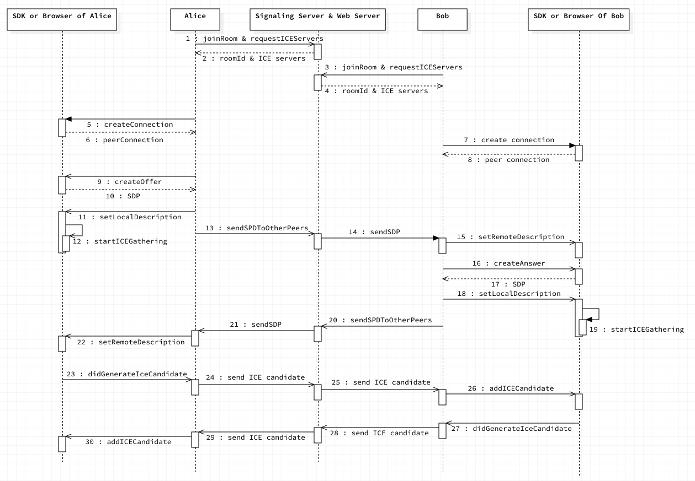

# Simulcast 笔记

## 操作

修改 simulcast.html 如 `let codecs_white_list = ['VP8']`

Chrome 打开 simulcast.html 查看 Local Video, Remote Videos, Bitrate 和 Framerate

点击 export sdp 存储 ~/Downloads/sdp.json

使用 `node ./sdp-parser.js` 查看 sdp

    - sdpObject.offer.origin.sdp
    - sdpObject.offer.modified.sdp
    - sdpObject.answer.origin.sdp
    - sdpObject.answer.modified.sdp

测试发现，H264 和 VP8 支持 Simulcast, VP9 不支持

## 流程

    Offer SDP: Peer A(Alice) createOffer 
    Offer SDP: Peer A(Alice) setLocalDescription origin, Peer B(Bob) setRemoteDescription modified 
    Answer SDP: Peer B(Bob) createAnswer 
    Answer SDP: Peer B(Bob) setLocalDescription origin, Peer A(Alice) setRemoteDescription modified 

)

## Simulcast 细节（Modified）

    Peer A(Alice)（即pc1）发送(*多路*)码流，Peer B(Bob)（即pc2）接收之；相应的，Peer B(Bob)也发送(*多路*)码流，Peer A(Alice)接收之

    以 Peer A(Alice) 作为 Senders, Peer B(Bob)作为分析来看 （即`draw(pc1, pc2)`）

    1-2, 3-4: Alice 和 Bob 都通过 API 进入房间，joinRoom 获得 roomId，并且通过requestIceServers 获得 Ice server （也就是 STUN 和 TURN server）的地址，然后连接到 WebSocket 服务器上。

    5-6, 7-8: Alice 和 Bob 都创建一个 PeerConnection，这个是个很重要的类，PeerConnection 负责编解码和传输的所有处理。

    9-10: Alice createOffer，创建 offer，通过创建 offer，底层会返回 SDP，就是自己所支持的音视频格式等描述信息。

    10-12: Alice createOffer 之后，把得到的 SDP，设置为 local description，同时会触发底层的 ICE candidate gathering，此时开始收集自己的 ICE candidate，也就前面提到的三种 IP 地址和端口。

    13-14: 把 （ 修改为支持 Simulcast 的offer ）SDP 通过 signaling server 发送给 Bob

    15，16-17: Bob 收到 （ 修改为支持 Simulcast offer ）SDP 之后，设置为 remote description，之后 Bob createAnswer，（createAnswer 和 createOffer 很类似，）也会收到底层返回的自己的 SDP。并设置为 local description。设置 local description 会触发底层 ICE candidate gathering. 此时，Bob 有了自己 （未修改的 origin answer sdp） 和对方的 （修改为支持 Simulcast的offer ）SDP.

    20-21: Bob 把自己的（修改为支持Simulcast的 answer ） SDP 通过 signaling server 发给 Alice

    22:  Alice 把收到的 Bob 的 （修改为支持Simulcast的 answer ）SDP，并设置为 remote description，此时，Alice 也有了自己（未修改的 origin offer sdp）和对方的 （修改为支持Simulcast的 answer ）SDP 了。

    23-26: 因为在 step 12 的时候开始了 ICE candidate gathering，当每收集到一个 candidate 之后，会触发 didGenerateIceCandidate 的回调， 此时 Alice 不做处理，直接通过 Signaling server 传递给 Bob，Bob 把 candidate 添加到 peer connection 里。

    27-30: 同 23-26 ，Bob 把自己的 IP 地址告诉 Alice。

参考:  https://enjoey.life/2019/02/24/webrtc-connection-establish/